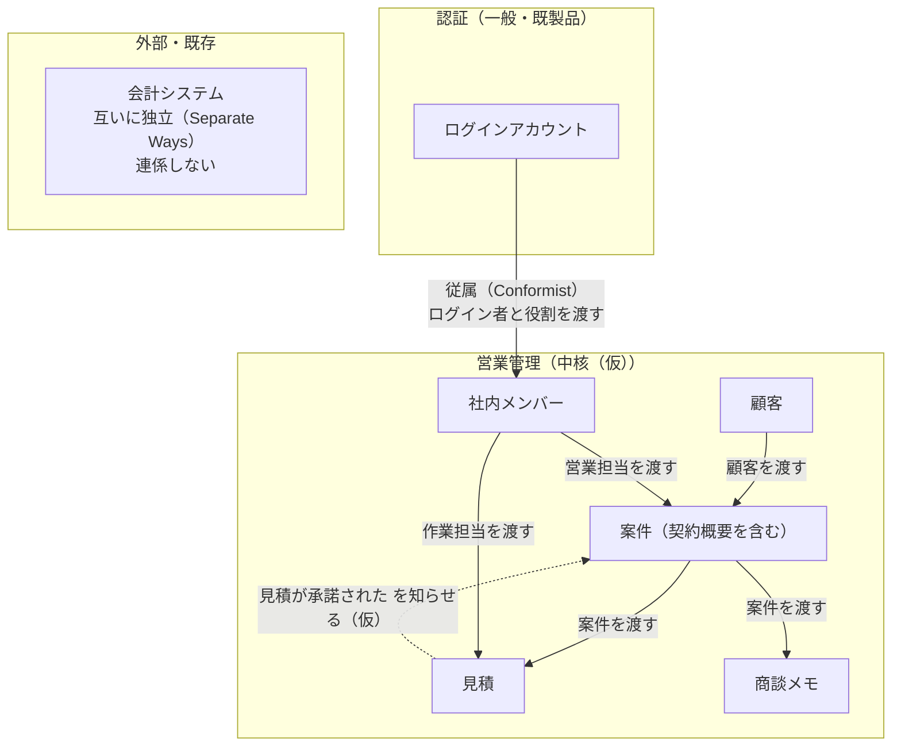

# sfa-lite の設計の土台

受託開発会社の数人〜20人の営業チームが、顧客・案件・見積・商談メモ・契約概要を1か所にまとめ、誰がどの案件を追っていて見積がいまどの状態かを追えるようにする、最小限の営業支援システム。

## 1. 全体像

### 1.1 どんなオブジェクトができて、どうつながるか

矢印は上流から下流へ、材料が流れる向きに引く。実線は材料を渡す（下流が上流を ID で参照する）、点線は出来事を知らせる。

外枠の箱は区切られた文脈（Bounded Context）で、同じ言葉を同じ意味で使う範囲を表す。中の箱は集約（Aggregate）のルートで、一緒に守る決まりを持つデータのまとまりを表す。
中心は「営業管理」の文脈にある「案件」と「見積」である。顧客と社内メンバーを材料に案件ができ、案件ごとに見積と商談メモが付く。見積が承諾されると案件に伝わり、案件が受注になってはじめて契約概要を残せる。

### 1.2 中核の業務領域とそれ以外

業務領域（subdomain）は、事業の中で関連する仕事をまとめた範囲を指す。

| 業務領域 | 種類 | 一言の理由 | 方針 |
|---|---|---|---|
| 見積の作成と状態追跡 | 中核（仮） | 人月×単価×作業担当の見積が受託開発の商売の形そのもので、計算ミスと番号重複と状態不明が一番の困りごと | 自前で作る。計算と状態遷移は関数に切り出して確かめる |
| 案件管理と契約概要 | 補完 | 誰が何を追っているかの見える化は必須だが、決まりは単純 | 素直に作る |
| 顧客管理 | 補完 | 登録・編集・アーカイブと重複防止だけ | 素直に作る |
| 商談メモ | 補完 | 日付と内容を残すだけ | 素直に作る |
| 社内メンバー管理 | 補完 | 選択肢の一覧を持つだけ | 素直に作る |
| 認証 | 一般 | どの会社でも同じ。既製品で足りる | 既製品（Better Auth） |
| 請求・入金・売上 | 対象外 | 別の会計システムが持つ | 作らない |

要件文に競合や差別化の記述が無いので、中核は（仮）とした。

### 1.3 必要な機能（抽象）

| 機能 | 中身の例 | どの文脈 | 作る／既製品／後回し |
|---|---|---|---|
| ログイン機能 | メールとパスワード、管理者と一般の区別、セッション | 認証 | 既製品 |
| メンバー管理機能 | 社内メンバーの登録・無効化、ログインアカウントとの対応付け | 営業管理 | 作る |
| 顧客管理機能 | 登録・編集・アーカイブ、会社名＋部署の重複防止 | 営業管理 | 作る |
| 案件管理機能 | 営業担当の割り当て、進行中／受注／失注、契約概要 | 営業管理 | 作る |
| 見積機能 | 明細の入力、小計・消費税・合計の自動計算、見積番号の自動採番 | 営業管理 | 作る |
| 見積の状態管理機能 | 作成中→提出済み→承諾／辞退／期限切れ、誰がいつ変えたかの履歴 | 営業管理 | 作る |
| 商談記録機能 | 案件ごとの日付と内容 | 営業管理 | 作る |
| 一覧・絞り込み機能 | 営業担当別の案件一覧、状態別の見積一覧 | 営業管理 | 作る |
| 画面 | サイドバー付きの React 画面（Vite + Tailwind + shadcn/ui）。業務ルールの関数はサーバーと同じファイルを読み込む | 営業管理 | 作る |
| アカウント管理機能 | 管理者によるアカウントの作成・役割の変更・利用停止と再開・パスワードの再設定。最初の管理者は初回セットアップ画面で作る | 認証 | 既製品（Better Auth の admin プラグイン）＋画面は作る |
| 個人設定機能 | 表示名の変更とパスワードの変更 | 認証 | 既製品＋画面は作る |
| 招待と登録機能 | ログインしている人なら誰でも、メールで招待を送れる。登録は招待リンクからだけにする。管理者が招待した人は登録後すぐ使える。一般ユーザーが招待した人は、管理者の承認が済むまでログインできない。リンクは7日有効で、1回だけ使える。トークンはハッシュにして保存する | 認証 | 作る |
| パスワード再設定機能 | ログイン画面からメールで再設定リンクを送る（Better Auth の機能） | 認証 | 既製品＋画面は作る |
| メール送信 | SMTP で送る。開発中は Docker Compose の Mailpit に届く | 認証 | 既製品（nodemailer） |
| ダッシュボード | 進行中の案件数、提出中の見積の件数と合計、今月の受注件数、最近の案件と商談メモ | 営業管理 | 作る |
| 帳票PDF・CSV入出力・電子契約 | 見積書PDF、取り込みと書き出し | 営業管理 | 後回し |
| 請求・入金・売上計上 | 請求書、消込、売上集計 | 会計システム | 作らない |

## 2. 詳細（仮）

### 2.1 同じ言葉

同じ言葉（Ubiquitous Language）は、業務担当者と開発者が同じ意味で使う言葉を指す。意味が2つ以上ある言葉を先に書く。

| 言葉 | 意味A | 意味B | どう分けたか |
|---|---|---|---|
| ユーザー | ログインする人のアカウント | 営業担当や作業担当に選ばれる社内の人 | 前者を「ログインアカウント」として認証の文脈に、後者を「社内メンバー」として営業管理の文脈に分けた。文脈を分けた根拠 |
| 担当者 | 顧客側の窓口の人 | 案件を追う社内の人 | さらに見積明細の作業をする社内の人という意味もある。「先方担当者」「営業担当」「作業担当」と呼び分ける |
| 承認 | 先方が見積を受け入れた | 社内の上長が見積を出してよいと認めた | 先方の受け入れを「承諾」と呼ぶ。社内承認は要件に無いので扱わない（仮） |
| 受注 | 案件の状態 | 見積が承諾されたこと | 「受注」は案件の状態だけに使う。見積側は「承諾」 |
| 顧客 | 会社 | 会社の中の部署 | 顧客1件は「会社名＋部署」の組とする（仮） |

主な用語。

| 用語 | 意味（日常語） |
|---|---|
| 顧客 | 取引先または見込み客。会社名＋部署で1件。見込み客かどうかは受注案件の有無で見分け、区別の列は持たない（仮） |
| アーカイブ | 使わなくなった顧客を一覧や新規案件の選択肢から外すこと。データは消さない |
| 案件 | 顧客との1つの商談の単位。営業担当が1人付く |
| 契約概要 | 受注した案件の契約形態（準委任／請負）、期間、金額の控え |
| 見積 | 案件に対して出す金額の提示。見積番号と状態を持つ |
| 見積明細 | 見積の1行。作業内容、数量、単位、単価、作業担当 |
| 見積番号 | 見積を一意に識別する番号。DB の採番で振る |
| 商談メモ | 案件ごとに残す、商談した日付と話した内容 |
| 社内メンバー | 営業担当や作業担当として選べる社内の人。辞めたら無効にする |
| ログインアカウント | システムに入るための認証情報。管理者か一般の役割を持つ |

### 2.2 必要な動作（業務イベント・コマンド・登場人物・外部システム・ポリシー）

業務イベント（domain event）は、業務上確定した出来事を過去形で表したものを指す。

| 種類 | 名前 | 誰が起こすか | 何が変わるか |
|---|---|---|---|
| 登場人物 | 一般ユーザー | 営業担当 | 顧客・案件・見積・商談メモを扱う |
| 登場人物 | 管理者 | 管理職など | 一般の操作に加え、メンバーとログインアカウントを管理する |
| 外部システム | 会計システム | 出力側（連係なし） | 請求以降を担う。このシステムからは何も渡さない |
| コマンド | ログインする | 一般ユーザー・管理者 | セッションができる |
| コマンド | メンバーを登録する／無効にする | 管理者 | 選択肢に出るメンバーが変わる |
| コマンド | 顧客を登録する／編集する | 一般ユーザー | 顧客の情報が変わる |
| コマンド | 顧客をアーカイブする | 一般ユーザー | 顧客が一覧と新規案件の選択肢から外れる |
| コマンド | 案件を作成する | 一般ユーザー | 顧客に案件が1件増え、営業担当が決まる |
| コマンド | 営業担当を変える | 一般ユーザー | 案件を追う人が変わる |
| コマンド | 案件を受注にする／失注にする | 一般ユーザー | 案件の状態が変わる |
| コマンド | 契約概要を登録する | 一般ユーザー | 受注案件に契約の控えが付く |
| コマンド | 見積を作成する | 一般ユーザー | 作成中の見積ができ、見積番号が振られる |
| コマンド | 見積明細を編集する | 一般ユーザー | 明細と小計・消費税・合計が変わる |
| コマンド | 見積を提出する | 一般ユーザー | 見積が提出済みになる |
| コマンド | 承諾を記録する／辞退を記録する | 一般ユーザー | 見積が承諾または辞退になる |
| コマンド | 期限切れにする | 一般ユーザー（自動にするかは未確認） | 見積が期限切れになる |
| コマンド | 商談メモを残す | 一般ユーザー | 案件にメモが1件増える |
| 業務イベント | 顧客が登録された | 顧客 | 案件の相手に選べるようになる |
| 業務イベント | 顧客がアーカイブされた | 顧客 | 新しい案件を作れなくなる |
| 業務イベント | メンバーが無効化された | 社内メンバー | 新しく営業担当・作業担当に選べなくなる |
| 業務イベント | 案件が作成された | 案件 | 営業担当別の一覧に出る |
| 業務イベント | 案件が受注になった | 案件 | 契約概要を登録できるようになる |
| 業務イベント | 案件が失注になった | 案件 | 案件が閉じる |
| 業務イベント | 契約概要が登録された | 案件 | 契約形態・期間・金額が残る |
| 業務イベント | 見積が作成された | 見積 | 番号付きの見積ができる |
| 業務イベント | 見積が提出された | 見積 | 明細を変えられなくなる。履歴に誰がいつが残る |
| 業務イベント | 見積が承諾された | 見積 | 履歴に残り、案件に伝わる |
| 業務イベント | 見積が辞退された | 見積 | 履歴に残る |
| 業務イベント | 見積が期限切れになった | 見積 | 履歴に残る |
| 業務イベント | 商談メモが記録された | 商談メモ | 案件の経緯が残る |
| ポリシー | 見積が承諾されたら、案件を受注にする（仮） | 見積→案件 | 受注の付け忘れがなくなる |
| ポリシー | 有効期限を過ぎた提出済みの見積は、期限切れにする（仮） | 未確認 | 期限切れの付け忘れがなくなる |

### 2.3 区切られた文脈どうしのつながり方

| 利用者側 | 供給者側 | 連係パターン（日本語／原語） | 一言の理由 |
|---|---|---|---|
| 営業管理 | 認証 | 従属（Conformist） | Better Auth のユーザー・セッション・役割の形をそのまま受け入れる。社内メンバーはログインアカウントの ID を任意で持つ |
| 営業管理 | 会計システム | 互いに独立（Separate Ways） | 請求以降は会計システムが持つ。今回は CSV も後回しなので受け渡しは無い |

### 2.4 集約と守る決まり

集約は、同時に守らなければならない決まりを扱う最小のまとまりを指す。他の集約は ID で参照する。

| 集約（ルート） | 中に持つもの | 守る決まり | 起こす出来事 | 他集約への参照（ID） |
|---|---|---|---|---|
| 顧客 | 会社名、部署、先方担当者、連絡先、メモ、アーカイブ状態 | 会社名は必須。会社名＋部署の組は重複しない。アーカイブ済みにも同じ組は作れず、使うならアーカイブを解除する（仮） | 顧客が登録された、顧客がアーカイブされた | なし |
| 社内メンバー | 氏名、連絡先、有効／無効 | 削除せず無効化する。無効のメンバーは新しく選べない | メンバーが無効化された | ログインアカウント（任意） |
| 案件 | 案件名、状態、営業担当、契約概要 | アーカイブ済みの顧客には作れない。状態は進行中→受注／失注。契約概要は受注の案件にだけ付く。契約概要がある案件は受注から戻せない（仮） | 案件が作成された、受注になった、失注になった、契約概要が登録された | 顧客、社内メンバー（営業担当） |
| 見積 | 見積番号、状態、有効期限、控えた税率、明細行、小計・消費税・合計、状態変更の履歴 | 小計は明細の金額の和、消費税と合計は小計から計算した値と常に一致する。明細を変えられるのは作成中だけ。状態は決まった遷移しか許さない。状態が変わるたびに誰がいつを履歴に残す。見積番号は重複しない。進行中の案件にだけ作れる（仮） | 見積が作成・提出・承諾・辞退・期限切れになった | 案件、社内メンバー（作業担当） |
| 商談メモ | 商談日、内容、記入者 | 案件に属する。商談日と内容は必須 | 商談メモが記録された | 案件、社内メンバー（記入者） |
| ログインアカウント | メール、パスワード、役割 | 既製品の決まりに従う。自分でサインアップさせず、管理者が作る（仮） | なし | なし |

見積の状態遷移（仮）: 作成中→提出済み、提出済み→承諾／辞退／期限切れ、の4本だけを許す。
消費税は見積全体の小計に1回だけ税率を掛け、円未満を切り捨てる（仮）。税率と端数処理は設定ファイルに置き、見積には作成時の税率を控える。

### 2.5 テーブルの当たり（仮）

| テーブル | 主キー | 最低限の列 | 最低限考慮すること |
|---|---|---|---|
| members | id | 氏名、メール、有効フラグ、auth_user_id | 削除せず無効化。auth_user_id は一意で空を許す |
| customers | id | 会社名、部署、先方担当者、連絡先、メモ、archived_at、比較用キー、版番号 | 比較用キー（前後の空白と全角半角を揃えた会社名＋部署）に一意制約。SQLite の一意制約は NULL を別物として扱うため、部署なしは空文字で持つ |
| deals | id | customer_id、案件名、営業担当 member_id、状態、受注日／失注日、版番号 | 論理削除はしない（仮）。営業担当で絞る索引 |
| deal_contracts | id | deal_id、契約形態、開始日、終了日、金額、元にした見積 id（任意） | 案件集約の一部。1案件1件なら deal_id に一意制約（未確認）。日付は暦日で持つ |
| quotes | id（自動採番） | 見積番号、deal_id、状態、有効期限、税率、小計、消費税、合計、版番号、作成者 | 見積番号は自動採番の id から書式化し一意制約。金額は円の整数。古い版番号での更新を弾く |
| quote_lines | id | quote_id、行番号、作業内容、数量、単位、単価、行金額、作業担当 member_id | 見積集約の一部。数量は 0.5 人月のような小数を扱う |
| quote_status_history | id | quote_id、変更前、変更後、変更者、変更日時 | 追記だけで更新・削除しない。日時は UTC で持ち、表示で日本時間にする |
| meeting_notes | id | deal_id、商談日、内容、記入者 member_id | 商談日は暦日。編集・削除の可否は後で決める |
| 認証用の各テーブル | Better Auth の生成に従う | ユーザー、セッション、アカウント、役割 | 既製品が作る形のまま使い、手で変えない |

業務上の数値は設定ファイルに名前を付けて置く。消費税率、端数処理の方式、見積番号の接頭辞、見積有効期限の既定日数がこれに当たる。DB に入れるかどうかは今回は決めない。

### 2.6 実装方式

| 文脈 | 実装方式 | 一言の理由 |
|---|---|---|
| 営業管理 | トランザクションスクリプト | 入力確認→計算→保存で足りる。見積の金額計算と状態遷移だけは、DB に触れない業務ルール関数に切り出して単体で確かめる |
| 認証 | 既製品（Better Auth） | 一般の業務領域。Prisma アダプターで SQLite に保存でき、admin プラグインで役割を持てる（ステップ2で要確認） |

技術方式（2026-09-27 に変更）: Node.js 22 + Hono（@hono/node-server）+ Prisma ORM 7.10.0 + SQLite。画面は `web/` にある React（Vite + Tailwind CSS v4 + shadcn/ui + TanStack Query + React Router）で作る。Hono はビルドした `web/dist` を配信し、画面は JSON API だけを呼ぶ。コンテナを起動すると、画面のビルドも毎回行う。開発環境は Docker Compose で起動し、SQLite のファイルはホストの `data/` に保存する。当初案の Cloudflare D1 + Drizzle はやめた。

構成は「Hono の API ルート＋集約ごとの業務ルール関数＋Prisma ORM 経由の保存」の3つだけにする。
Repository インタフェース、UseCase クラス、DTO 変換層は作らない。
ファイルは集約ごとに `customers/` `members/` `deals/` `quotes/` `notes/` に分け、各フォルダに API ルートのファイルと業務ルール関数のファイルを置く。
DB の表定義は `prisma/schema.prisma`、業務上の数値は `src/config/business.ts`、認証の設定は `src/auth.ts` に置く。どのファイルも1000行を超えたら集約単位で分ける。

保存の決まりは次のとおり。

- 1つの集約で複数行を書くときは Prisma の `$transaction` にまとめ、全部成功か全部取り消しにする。
- 同時更新は版番号で防ぐ。トランザクションの先頭で「版番号が読んだ時と同じなら版番号を1つ上げる」更新（`updateMany` の件数で判定）を置く。0件なら先に誰かが保存したので、取り消して利用者にやり直してもらう。
- 見積番号はアプリで最大値に1を足さない。quotes の自動採番の id から書式化する。
- 見積の状態変更と履歴の追加は同じ batch で保存する。
- 見積承諾から案件受注へのポリシーは、同じリクエストの中で見積の保存が成功した後に案件を更新する（仮）。送信箱のような仕組みは入れない。

確認した事実と出典。

- Prisma 7 では generator を `prisma-client` にして output を必ず指定し、SQLite には `@prisma/adapter-better-sqlite3` を渡して PrismaClient を作る。接続先は `prisma.config.ts` に書く。https://www.prisma.io/docs/v7/prisma-orm/quickstart/sqlite
- npm の `prisma` の latest タグは 8.0 のRC版を指しているため、`prisma`・`@prisma/client`・アダプターは安定版 7.10.0 に固定する。
- Better Auth は admin プラグインで役割を扱える。https://www.better-auth.com/docs/plugins/admin

### 2.7 デザインパターン（逆引き表の 11 パターンから、最大 3 件）

| パターン | 当てる場所 | 要件文の言い回し | 迷った隣と選ばなかった理由 | 出典（URL 全文） |
|---|---|---|---|---|
| State | 見積の状態と遷移 | 「作成中なのか、先方に提出済みなのか、承認されたのか、断られたのか、期限切れなのかが追えない」 | Command も考えたが、取り消しや後で実行する要求は無い。履歴は記録だけで足りる。実装はクラスにせず、状態の共用体と遷移の対応表と switch で書く | https://www.techscore.com/tech/DesignPattern/State.html |

表に無い書き方として、消費税の端数処理は設定ファイルの値で選び、切り捨て・四捨五入などを名前付き関数にして switch で呼び分ける。パターン名は付けない。
案件の状態は3つで操作による違いも小さいので、State は当てず if で足りる。

## 3. 決めてもらうこと（最大 8 個）

2026-09-27 に、下の8問はすべて次の答えで確定して実装した。

- 1: 提出後の修正は、新しい見積番号で作り直す。同じ番号の版管理はしない。
- 2: 見積が承諾されたら、同じトランザクションで案件を受注にする。案件の状態は進行中・受注・失注の3つ。
- 3: 期限切れは担当者が手で付ける。定期実行は作らない。
- 4: 社内メンバーとログインアカウントは別に持つ。商談メモの記入者と状態履歴の変更者は、ログインアカウントの ID と名前の控えで残す。
- 5: 契約概要は1案件に1件で、受注と失注から他の状態へは戻さない。
- 6: 一般ユーザーも全員の顧客・案件・見積を編集できる。メンバー管理とアカウント作成は管理者だけ。
- 7: 先方担当者は1部署に1人とし、顧客の列で持つ。
- 8: 見積番号は `Q-` と6桁の通し番号にする。自動採番の id から作る。

元の質問:

1. 提出後に先方から修正を求められたら、同じ見積番号のまま版を上げますか。それとも新しい見積番号で作り直しますか。分かると見積集約の範囲、見積番号の書式、quotes に版番号や元の見積 id を持つかが確定する。
2. 見積が承諾されたら、案件を自動で受注にしてよいですか。案件の状態は進行中・受注・失注の3つで足りますか。分かると図の点線、ポリシー、案件の状態遷移が確定する。
3. 見積の期限切れは、有効期限日を過ぎたら自動で付けますか。担当者が手で付けますか。分かると定期実行の有無、履歴の変更者を誰にするか、ポリシーが確定する。
4. 作業担当に選ぶ社内メンバーは全員ログインしますか。ログインしない技術者もいますか。分かると社内メンバーとログインアカウントを1つにまとめるか分けたままにするかが確定する。
5. 契約概要は1案件に1件ですか。準委任の更新や追加契約で複数件になりますか。受注後に取り消して失注へ戻すことはありますか。分かると deal_contracts の一意制約と、契約概要を案件集約の中に置き続けるかが確定する。
6. 一般ユーザーは、他人が営業担当の案件や見積を編集できますか。管理者だけに許す操作は、メンバー管理のほかにありますか。分かると各集約の守る決まりと API の権限確認が確定する。
7. 同じ会社・同じ部署に先方担当者が複数いることはありますか。分かると先方担当者を顧客の列で持つか、別テーブルに分けるかが確定する。
8. 見積番号は通し番号でよいですか。年ごとに1から振り直しますか。分かると採番を自動採番の id だけで済ませるか、年ごとの採番テーブルを足すかが確定する。

## 付録: 実装ステップ案

各ステップで API と最小の画面を作り、完了条件を満たしてから次へ進む。

2026-09-27 時点で、ステップ1〜7は実装済みで、確認も済んでいる。確認の中身は、単体テスト9件（`npm test`）と Playwright の2本（`npx playwright test`）。Playwright の2本は、画面で一連の流れを通すものと、業務ルールと権限を API で確かめるもの。ステップ8は配置先が決まっていないので未着手。

1. 土台と社内メンバー: Hono、Prisma、SQLite、Docker Compose を用意し、members の登録と一覧を作る。完了条件は、`docker compose up` でマイグレーションが適用され、メンバーを登録して一覧に出て、コンテナを作り直してもデータが残ること。
2. ログインと役割: Better Auth を組み込み、全 API をログイン必須にする。完了条件は、未ログインは 401、一般ユーザーのメンバー登録は 403、管理者は成功すること。
3. 顧客: 登録・編集・アーカイブ・一覧を作る。完了条件は、空白や全角半角だけが違う同じ会社＋部署の登録が弾かれ、アーカイブした顧客が一覧から消えること。
4. 案件と商談メモ: 案件の作成、営業担当の変更、受注・失注、商談メモを作る。完了条件は、営業担当で絞った案件一覧が出て、アーカイブ済み顧客への案件作成が弾かれること。
5. 見積の計算: 金額計算の業務ルール関数を先に作り、単体テストで確かめてから見積の作成と明細編集を作る。完了条件は、0.5 人月を含む明細で小計・消費税・合計がテスト通りになり、2件続けて作っても見積番号が重複しないこと。
6. 見積の状態と履歴: 提出・承諾・辞退・期限切れと履歴を作る。完了条件は、許さない遷移と作成中以外の明細編集が弾かれ、古い版番号での保存が弾かれ、履歴に変更者と日時が出ること。
7. 契約概要と受注の連動: 契約概要の登録と、見積承諾から案件受注へのポリシーを作る。完了条件は、受注でない案件への契約概要の登録が弾かれ、承諾した見積の案件が受注になること。
8. 本番への配置: 配置先は未定。完了条件は、配置先でログインから見積の承諾と契約概要の登録まで通ること。
